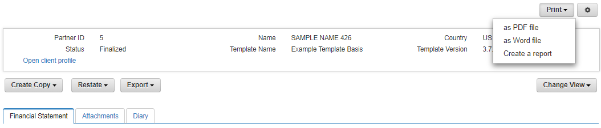

:cm-attachmentsUpload: <<client-management#cm-attachmentsUpload>>
:cm-attachmentsDownloadRemove: <<client-management#cm-attachmentsDownloadRemove>>
:cm-filterCapabilitiesDataTypes: <<client-management#cm-filterCapabilitiesDataTypes>>
:cm-clientDataManagement: <<client-management#cm-clientDataManagement>>
:cm-searchClient: <<client-management#cm-searchClient>>

:fs-financialStatement:  Financial Spreading
[[financialStatement,{fs-financialStatement}]]
= {fs-financialStatement}

== Overview
Capturing, importing and spreading of financial statements and financial ratios are key processes in credit risk management. The Credit Risk Management Platform offers a comprehensive feature set for collecting, analyzing, and storing financial statements, including but not limited to balance sheets, income statements, and cashflow statements.

The credit analysts are provided with a user-friendly, web-based front-end to capture and analyze financial statements. 

The Financial Spreading Module has been designed and implemented with flexibility in mind. Any number of financial statements and spreading templates (e.g. for different industries or accounting standards) defining the structure of financial statements and a set of financial ratios can be defined using Excel. 

The financial analysis and spreading can be seamlessly integrated with risk rating processes. For clients using the Credit Risk Rating Platform for risk ratings, specific integration points are being provided.

The financial data can also be exported for further reporting and analytical purposes.

:fs-financialStatement-lifecycle:  Financial Statement Lifecycle and Activities
[[fs-financialStatementLifecycle,{fs-financialStatement-lifecycle}]]
== {fs-financialStatement-lifecycle}
The following figure describes the activities and context of financial statements in CRMP.

image::FinancialStatement/100_FSLiefecycle.png[{width75}, align=center]

A financial statement is always based on a spreading template and attached to a specific client.

Statements can be captured manually in the web interface or by importing them from Excel, XBRL or XML. 

Once a financial statement is created in the system a variety of activities can be performed.

* calculate: perform calculations of predefined KPIs and ratios, validate the input or create statement specific custom ratios. 
* annualize: combine a set of interim statements to an annual statement
* consolidate: combine statements of a group of clients to analyze the overall group

During the whole lifecycle, statements can be copied, discarded or enriched via attachments and notes.

* copy: use an existing statement as a template for creating a new statement 
* discard: discard the statement if no longer required
* attachments: add additional information, such as business reports or other sources elaborating the financial statement
* comment: add notes to a statement, position or ratio

Furthermore, CRMP supports you in your business processes by providing a customizable workflow to manage the lifecycle of a statement. 

As changes might be necessary after a finalization of a statement, the restate functionality offers the possibility to discard an existing statement and create a copy of it ine one step. 

A financial statement, per default can have one of the following status with the assigned role in charge.

[cols=3, options="header"]
|====
|Status |Description |Role with Workitem
|draft |Statement can be saved ignoring validation checks. |Financial Analyst
|calculated |All mandatory meta information have been entered and validations have been performed after the calculate functionality was executed. |Financial Analyst
|awaiting finalization | All validation checks were successfully executed and the financial analyst has requested the finalization by the financial approver. Its feedback is outstanding. |Financial Approver
|finalized |The financial approver has finalized the statement. |None
|declined |The financial approver has declined the statement and send it back to the financial analyst for further processing. The financial analyst can perform adaptions and send it back for finalization. |Financial Analyst
|discarded |The statement is removed from the business process. |None
|====

== Statement Management

A financial statement consists of the following sections:

* Meta Information: metadata of the statement like accounting date, publication date, type of the statement and currency.
* Income Statement: structure to enter and calculate the client's financial performance
* Balance Sheet: structure to enter and calculate the client's assets, liabilities, and capital
* Ratios: a set of predefined KPIs to further elaborate the client's financial situation
* Custom Ratios: allows to add specific KPIs for the client
* Notes: provides an overview of all notes per KPI, account, as well as statement level

Additional sections, such as cash flow reports can be defined in the templates, as described in section <<fs-template>>.

=== Process
:fs-capture: Capture
[[fs-capture,{fs-capture}]]
==== {fs-capture}
Capturing a financial statement is defined as the process of manually recording financial information in the provided web interface. 
To capture financial statements, a template (see section <<fs-template>>) and client (see section <<cm-clientDataManagement>>) has to be available.

1. Open a clients details page and switch to tab *Financial Statement*
2. Select a *Financial Template* from the provided drop down (see section <<fs-template>> for additional information)
+
image::FinancialStatement/1800_FSCaptureOne.png[{width75}, align=center]
+
3. Optional: Enter the *Fiscal Year End* in the format MM/DD
+
The *Fiscal Year End* is used to pre-fill the Accounting date, when creating new statements. 
+
4. Set the *Number of New Statements*
+
Setting this value allows you to capture more than one period of a financial statement at once. 
+
[col=2,grid=none, frame=none]
|====
a|image::FinancialStatement/1900_FSCaptureOneStatement.png[width=35%, align=center] a|image::FinancialStatement/2000_FSCaptureThreeStatement.png[width=35%, align=center]
|====
+
5. Enter the financial statement records
+
When entering the financial statement data you can use the available spreading capabilities:

* Enter/Remove detail rows
* Add additional ratios or KPIs
* Comment on positions
* Show historic statement for comparison 
+
For further information please refer to section <<fs-workingWithGrid>>.

6. Press *Save* to store the current state and put the statement in status "Draft".
7. To evaluate and check the financial statement against existing validation rules, press *Calculate*
+
Pressing *Calculate* checks all required fields and provides warning messages, if invalid entries have been found.
+
image::FinancialStatement/2100_FSCaptureCalculateWarning.png[{width75}, align=center]
+
If no errors occur, the statement is saved, put in status "Calculated" and read-only fields - marked in grey - are updated, based on the formulas provided in the spreading template.
+
image::FinancialStatement/2200_FSCaptureCalculateSuccess.png[{width75}, align=center]

8. To make the statement ready to be reviewed by a Financial Approver, press *Send for Finalization*
+
The statement and client will be moved to the worklist of the Financial Approvers. Refer to section <<fs-financialStatementLifecycle>> for further details.

To review the current status of a statement, you can:

* check the financial statement section of the clients detail page (see section <<cm-searchClient>>)
* search for a statement (see section <<fs-searchStatement>>)
* check the statement's worklist (see section <<fs-statementWorklist>>)

==== Edit all Draft Statements
CRMP provides a convenient way to edit all financial statements in status "Draft" of a client.

1. Open the client's details view as described in section {cm-searchClient}
2. Open tab *Financial Statement* 
+
image::FinancialStatement/9800_FSEditDraftsOverview.png[{width75}, align=center]

3. Press *Edit all Drafts*
+
CRMP will open all statements in status "Draft", "Calculated" or "Declined" listed in the table in section *Financial Statement*. 
+
Please refer to section <<fs-capture>> and <<fs-workingWithGrid>> on how to edit and further process the statements.

[WARNING]
====
The spreading template and versions used for the statements has to be the same. Otherwise an error message is thrown.

image::FinancialStatement/9900_FSEditDraftsErrorTemplate.png[{width75}, align=center]

To change the template of a statement create a new copy of the statement with a matching template as described in section <<fs-copy>>
====

:fs-search-statement: Search Statement
[[fs-searchStatement, {fs-search-statement}]]
==== {fs-search-statement}
1. Open Menu *Statement - Search*
+
image::FinancialStatement/4900_FSSearchMenu.png[{width50},align=center]

2. Enter search criteria and hit enter or press *Search*
+
The entered search criteria will be combined with an AND statement. This means that the returned search result has to match all criteria.
+
image::FinancialStatement/5000_FSSearchResult.png[{width75},align=center]

3. Click on the *Statement ID* to open the statement's details page, if needed.
4. To export the search results, press button *Download Search Results*. An Excel file containing the data visible in the *Search Results* section is made available for download.
5. To clear all filters press *Reset filter*

==== Annualize 
CRMP offers the capability to annualize statements.

1. To create an annualized statement, open the client's detail page as described in section {cm-searchClient}
2. Open tab *Financial Statement*
3. Select a template from drop down *Financial Template* and enter a *Fiscal Year End* (see section <<fs-capture>>)
4. Press *Create Annualized Statement*
+
image::FinancialStatement/8600_FSAnnualizeMenu.png[{Width75},align=center]

5. To search for the input statements to be annualized, update filter criteria and press *Search*
+
image::FinancialStatement/8700_FSAnnualizeSelectInputStatements.png[{Width75},align=center]

6. Select the input statements, by pressing *Select* in the respective rows of *Search results*
+
image::FinancialStatement/8800_FSAnnualizeSelectInputStatements.png[{Width75},align=center]

7. In section *Selected statements* you can find and organize the already chosen statements
+
* to clear the list of chosen statements, press *Remove all*
* to remove a single statement, press the button in column *Remove* of the respective statement
* to change the order of multiple statements, use the buttons in columns *Move up* or *Move down*. The order of statements does not have any effect on the annualization, but on the visualization in the following screens.
+
8. Select the *Annualization Type*
+
[cols="1,2", options="header", align=center]
|====
|Annualization Type |Description
|Interim Statement Approach a|Calculate the annualization based on cumulative statements with formula: 
----
[Y-1 End of Year]-[Y-1 Interim] + [Y Interim]
----
a|Continuous Statement Approach a|Annualize based on non-cumulative statements, that are non overlapping and cover a period of twelve months. Formula is:
----
sum(interim statements)
----
|====
+
NOTE: Ensure the selected statements sum up to 12 months or suffice the *Continuous Statement Approach*.

9. Press *Start Annualization* 
+
image::FinancialStatement/8810_FSAnnualizeSelectOverview.png[{Width75},align=center]

10. You can now edit the entries of the import statements for correction purposes
11. Press *Calculate* to update the values of the consolidated statement
+
NOTE: CRMP will aggregate all enabled values for financial statements. The balance sheet is not aggregated, but the latest accounting date is used for the annualized statement.

12. Press *Finish Annualization* to complete the process
13. An editable version of the annualized statement is provided for review
+
image::FinancialStatement/8820_FSAnnualizeSelectResult.png[{Width75},align=center]
+
NOTE: In the *Meta Information* tab, the *Consolidation Type* is set to sum.

14. Press *Save* or *Calculate* to persist the annualized statement

==== Consolidate
The statement consolidation (sometimes also referred to as statement aggregation) provides a functionality to consolidate multiple statements into a single, consolidated statement.

It is possible to consolidate up to 5 statements. 

The consolidation is performed by summing up on a KPI/account basis. 

The consolidation process consists of the following steps.

1. To create a consolidated statement open the client's detail page as described in section {cm-searchClient}
2. Open tab *Financial Statement*
3. Select a template from drop down *Financial Template* and enter a *Fiscal Year End* (see section <<fs-capture>>)
4. Press *Create Consolidated Statement*
+
image::FinancialStatement/8600_FSAnnualizeMenu.png[{Width75},align=center]

5. To search for the input statements to be consolidated, update filter criteria and press *Search*
+
image::FinancialStatement/8900_FSConsolidateSelectInputStatements1.png[{Width75},align=center]

6. Select the input statements, by pressing *Select* in the respective rows of the search results
+
image::FinancialStatement/9000_FSConsolidateSelectInputStatements2.png[{Width75},align=center]

7. In section *Selected statements* you can find and organize the selected statements
+
* to clear the list of selected statements, press *Remove all*
* to remove a single statement, press the button in column *Remove* of the respective statement
* to change the order of multiple statements, use the buttons in columns *Move up* or *Move down*. The order of statements does not have any effect on the consolidation, but on the visualization in the following screens.

8. Press *Start Consolidation*
+
The input data and the consolidated results are visualized for review.
+
image::FinancialStatement/9200_FSConsolidateBalanceSheet.png[{Width75},align=center]

9. To change the selection of statements, press *Change Selection* and proceed as described in 7.

10. Finalize tab *Meta Information* and press *Calculate*
+
image::FinancialStatement/9100_FSConsolidateSelectCompleteMeta.png[{Width75},align=center]

11. Press *Finish Consolidation* to create the consolidated statement
+
The created statement can now be edited like a new captured statement as described in section <<fs-capture>>. The prefilled values will be set as shown in the consolidation view of step 8.
+
NOTE: Depending on a system setting the created statement is automatically saved.

12. To see the statements consolidated to create the new statement, press *Change View* and select *Show related statements*
+
[cols=2, grid=none, frame= none]
|====
a|image::FinancialStatement/9300_FSConsolidateShowRelatedStatementsMenu.png[{width50}, align=center] a|
| a|image::FinancialStatement/9300_FSConsolidateShowRelatedStatementsResult.png[{width50}, align=center]
|====

NOTE:  In case the user made manual changes in the base statements' values while creating the aggregated statement, these change are not visible in this view. 

==== Finalize or Decline
As a Financial Approver statements have to be reviewed and finalized, declined or discarded to finish the process.

1. To open the relevant statements, navigate to *Statement - Worklist*
+
image::FinancialStatement/9500_FSWorklistMenu.png[{width50}, align=center]

2. In the result list of your selected *Worklist View* press on the *Statement ID* you want to open
+
image::FinancialStatement/9400_FSWorklistFinancialApprover.png[{Width75},align=center]

3. The statement is opened in read only. Review the statement and decide whether to
+
* *Discard*: the statement is discarded as described in section <<fs-discard>>
* *Decline*: the statement is set to status "Declined" and moved it back to the worklist of Financial Analysts
* *Finalize*: the statement is set to status "Finalized" and can therefore be be used in ratings, annualizations and consolidations. It will not be listed in any worklist of Financial Approvers or Financial Analysts

+
by pressing the corresponding button.

NOTE: The statement will be set to the corresponding status and saved in a new revision.

:fs-restate-statement: Restate
[[fs-restateStatement, {fs-restate-statement}]]
==== {fs-restate-statement}
The user has the possibility to restate existing statements in status "Finalized". 

1. Open the detail view of the selected statement (see section <<fs-searchStatement>>)
2. Press *Restate* and choose between *Internal reasons* and *External reasons*
+
image::FinancialStatement/9600_FSRestate.png[{Width75},align=center]
+
"Restate" triggers the following steps
+
* Create a copy of the current statement with all existing business data and meta information
* The copy is based on the most recent active version of the current spreading template
* The "Statement Restated" meta information is set to the reason selected by the user (internal or external reasons)
* Save the copy in status "Draft"
* Discard the statement on which "Restate" was triggered

[NOTE]
====
* References to external statements (e.g. used for multi year ratios) are not copied during the restating process. After restating, the user can re-select the required external statements.
* References to related statements (created during the statement consolidation) are not copied during the restating process.
====

:fs-statement-worklist: Statement Worklist
[[fs-statementWorklist, {fs-statement-worklist}]]
==== {fs-statement-worklist}
The statement worklist provides a search with predifined filters for your role.

1. To open the statement worklist go to *Statement - Worklist*
+
image::FinancialStatement/10900_FSStatementWorklistMenu.png[{Width50},align=center]

2. Select a *Worklist View* to switch between predefined filters
+
image::FinancialStatement/10900_FSStatementWorklistChangeWorklistView.png[{Width75},align=center]

3. To open the detail view of a statement press on the *Statement ID*

[NOTE]
====
Please refer to:

* <<fs-financialStatementLifecycle>> for details on the assigned roles per status
* <<fs-searchStatement>> for a search with dynamic filters

====

:fs-statement-re-import: Statement Re-Import 
[[fs-statementRe-import, {fs-statement-re-import}]]
==== {fs-statement-re-import}
Reimporting statements allows to export a statement, modify the values of statements and re-import it.

1. To re-import a statement open the statement's detail view (see section <<fs-searchStatement>>)
2. Press *Export* and select *Export to Excel for Re-Import*
+
image::FinancialStatement/11000_FSStatementReImportExportStatement.png[{Width75},align=center]

3. Open the downloaded Excel and enter the values as described in <<fs-fillExcelStatement>>
4. Switch to tab *Statement Re-Import*
+
image::FinancialStatement/12000_FSStatementReImportImportStatement.png[{Width75},align=center]

5. Press *Choose File*, select the enriched file and press *Open*
6. Press *Import* to read the data
7. Press *Save* or *Calculate* to persist the changes. A new revision is created and an entry to the statement's *Diary* is added
+
image::FinancialStatement/12100_FSStatementReImportDiary.png[{Width75},align=center]

=== Analyze and Report

==== Statement Comparison
CRMP allows to compare statements of the same or different clients with each other.
Besides the functionality to <<fs-compareHistoricStatements>> the compare statement functionality allows to compare statements of

* different clients
* different currencies
* different templates
* different types

1. To compare a set of statements select *Statement - Statement Comparison*
+
image::FinancialStatement/10000_FSCompareStatementsMenu.png[{width50}, align=center]

2. Use the provided search screen to identify the to be compared statements
+
Refer to section <<fs-searchStatement>> for further details on the search functionality.
+

NOTE: Statements in status "Draft" cannot be compared and therefore do not appear in the search results.

3. Press *Select* in the specific rows or *Select all* to add the statements for comparison
+
image::FinancialStatement/10100_FSCompareStatementsSearchResults.png[{width75}, align=center]

4. Define the master statement by changing the order of the selected statements, using the buttons in *Move up* and *Move down* in section *Selected statements*
+
====
The first statement is considered the master statement and defines:

    * target currency
    * target unit of measurement
    * target structure
====
5. Press *Start comparison* to trigger the compare mechanism and display the selected statements in read only
+
====
In the comparison process, the following steps are executed and reflected in the frontend:

* Currency conversion
** the master statement defines the target currency
** the system settings define the base currency
** the statements currency is transformed into base currency and then transformed into target currency
** exchange rates used are made visible in the *Meta Information* tab
* unit of measurement is set to target unit of measurement for all statements
* statement structure is harmonized
** based on the target structure, all matching keys amongst the statements are moved to the top
** rows with missing entries in one or more statements are added at the bottom of the table
** statements with no matching rows are displayed as empty fields
* delta columns
** the deviation in percent between the statements from left to right is displayed in delta columns between the statements
====
+
image::FinancialStatement/10300_FSCompareStatementsIncome.png[{width75}, align=center]

6. To change the order or the selection of statements, press *Change statement selection*

NOTE: For more detailed reporting capabilites, please refer to section <<fs-statementReport>>

==== Peer group Analysis
Besides the possibility to display a unique set of statements next to each other, financial statement reports can include benchmark (peer group) data. These type of reports are defined in the report designer and are thus fully flexible in adapting the aggregation logic (e.g. by portfolio, industry, asset size) and the way the peer group data is being displayed.

Please refer to section <<fs-statementReport>> for further information.

==== Export
CRMP can export financial statements to Excel. 

1. Open a statement in the detail view. See section <<fs-searchStatement>>
2. Press *Export* and choose between
+
====
* *Export to Excel*: The exported Excel file will contain the statement together with the corresponding metadata and partner information. It is exported in the currently selected language.  
* *Export to Excel for re-import*: An export allowing to modify and re-import the data (see section <<fs-statementRe-import>>)
====
+
image::FinancialStatement/10400_FSExportMenu.png[{width75}, align=center]

3. Download and open the Excel. Refer to section <<fs-importStatement>> to learn more about the structure of the Excel.

NOTE: The Export functionality is only available for statements that have been saved at least once.

:fs-print-statement: Print
[[fs-printStatement, {fs-print-statement}]]
==== {fs-print-statement}
CRMP, out of the box, allows to print a single financial statement to PDF or Word.

The printed sections compare to the detail view of financial statements in the platform.

Included sections are

* Client Profile Information
* Meta Information
* Financial Statements (e.g. Income Statement, Balance Sheet, Cash Flow Reports)
* Ratios and Custom Ratios
* Notes

1. Open a financial statement in the detail view (see section <<fs-searchStatement>>) 
2. Press *Print* and select *as PDF file* or *as Word file* to download the printout in the respective format
+

NOTE: The layout and included sections are usually adapted during CRMP rollout

NOTE: The printout is reduced to the currently selected financial statement. Related or historic statements will not be contained. Please refer to section <<fs-statementReport>> to extract multiple statements.

:fs-statement-report: Report
[[fs-statementReport, {fs-statement-report}]]
==== {fs-statement-report}

To print multiple statements, visualize trends and enrich financial statements with external data, CRMP supports the creation of reports.

Reports that are specific to a certain statement, can be triggered from the statement's detail view.

1. Open a financial statement in the detail view (see section <<fs-searchStatement>>) 
2. Press *Print* and select *Create a report*
+
image::FinancialStatement/12300_FSReportMenu.png[{width75}, align=center]

3. On the report creation screen the following sections are provided:
+
* *Select Report*: select the report template you want to render from drop down *Report*
* *Parameterize Report*: section displaying the available parameters of the selected report template (e.g. Currency)
+
image::FinancialStatement/12200_FSReportOverview.png[{width75}, align=center]
+
[NOTE]
====
Permissions need to be assigned for each report template by the administrator in order for beeing available for selection.
====

4. Press *Generate* to create the report and download the PDF file. 
5. Press *Go Back* to return to the initially selected Financial statement

NOTE: Only statements that have been successfully calculated can trigger reports. Please refer to section <<fs-capture>>

:fs-import-statement: Import
[[fs-importStatement, {fs-import-statement}]]
=== {fs-import-statement}
CRMP allows to import financial statements from Excel, XBRL and XML. Statements can be uploaded one by one, multiple years within one file or via a bulk import functionality muliple files in a batch.

In the following sections it is described how to:

* Generate an import template
* Fill out an Excel import template
* Import a financial statement for one or multiple years
* Import a financial statement from XML/XBRL
* Set up a scheduled bulk import

Those operations can be performed via menu *Statement - Import Statements*

image::FinancialStatement/5100_FSImportStatementMenu.png[{width50}, align=center]

:fs-generate-import-template: Generate an import template
[[fs-generateImportTemplate, {fs-generate-import-template}]]
==== {fs-generate-import-template}
1. Open tab *Generate Import Template*
+
image::FinancialStatement/5200_FSImportStatementOverview.png[{width75}, align=center]

2. Select the *Number of entries in the import template* as a value between 1 and 5
+
This will define the number of periods prepared in the import template.

3. Decide to check *Generate detail item import sheets* 
+
Checking this box will enable the creation and import of values for detail rows (see section <<fs-createDetailRow>>). 
+
[cols=2, grid=none, frame= none]
|====
a|image::FinancialStatement/5300_FSImportStatementGenerateTemplateDetailLink.png[{width50}, align=center] a|
| a| image::FinancialStatement/5400_FSImportStatementGenerateTemplateDetailRows.png[{width50}, align=center]
|====
+
The entries are pre-filled with the existing detail rows of the template.

4. Decide to check *Translate row and column headers* 
+
Checking this box will provide the capability to switch the language for the row and column headers by choosing a language key in the import template on sheet *fs-summary*.
+
image::FinancialStatement/5500_FSImportStatementGenerateTemplateLanguage.png[{width50}, align=center]

5. From the list of active templates, choose the basis for your Excel import template and press *Select Template* in the corresponding row
+
The Excel import template will be made available for download.

:fs-fill-Excel-statement: Fill out an Excel import template
[[fs-fillExcelStatement, {fs-fill-Excel-statement}]]
==== {fs-fill-Excel-statement}
The Excel import template is highly dependent on the underlying template and options selected as described in section <<fs-template>>.

Therefore descriptions, and available validations in the import template may vary.

It is possible to import up to 5 statements from a single Excel file. The statement data needs to be added to the statement import template. Multiple statements (e.g. for different fiscal years) have to be provided in separate columns. Each statement needs to have a unique column headline. The order of the statements in all sheets of the Excel import file has to be the same.

The generated Excel import file already contains the required sheets from the template as well as the following Financial Spreading specific sheets:

[cols=2, options="header"]
|====
|Sheet name |Description
|fs-summary |Summary sheet that contains the reference to the Financial Spreading template 
|fs-metadata |Statement specific metadata
|fs-partner-information |Assigned clients to the statement(s)
|fs-notes |Sheet containing notes for the statements
|fs-detail-sheet-mappings |Sheet containing the mapping relations between sheets defined in the template and detail item sheets (only existing if the *Generate detail item import sheets* checkbox was checked)
|====

===== Sheet fs-summary
The *fs-summary* sheet provides the link between the Excel import file and the corresponding Financial Spreading template. All statements within an Excel import file need to be based on the same Financial Spreading template and the same version of it. The template needs to exist in CRMP before the import.

image::FinancialStatement/5600_FSImportStatementFillTemplateSummary.png[{Width75},align=center]

By default all sheets in the statement template are taken into account for the import. It is not recommended to add additional sheets to the generated import template. 

There is no need to update any values on sheet *fs-summary*.

===== Sheet fs-metadata
The sheet *fs-metadata* provides the metadata for the statements that shall be imported to tab *Meta Information*. The sheet must contain exactly one column for each statement. The generated Excel import template will already contain rows for the Financial Spreading metadata. 

image::FinancialStatement/5700_FSImportStatementFillTemplateMetadata.png[{Width75},align=center]

The table below explains typical metadata fields

[cols=2, options="header"]
|====
|Attribute |Description
|Statement Type a|Choose the type of statement you want to import. Options: 

* annual
* semi annual
* quarterly
* interim

|Accounting Date a|Accounting date
|Accounting period a|Accounting period in months
|Comment a|The Final Assessment note of the statement
|Currency a|Currency the provided values are entered in
|Measurement Unit a|Define whether the provided values are received in thousands, millions or plain. This setting will ensure that during comparison, an automatic scaling is performed  
|Publication Date a|Date the financial statement was published
|Restated a|Flag to state whether the financial statements provided are an update to an earlier version
|Statement Category a|Defines what type of statement is provided. Options are:

* default
* annualized
* consolidated
* peer group

|Statement Name a|A name to describe the statement within CRMP
|====

Depending on the system configuration it might be possible to omit dedicated meta data items if they will be automatically set (e.g. sector is retrieved from external service). In this case the user does not have to fill out these elements in the import file and they will be set during import.

===== Sheet fs-partner-information
The *fs-partner-information* sheet links the statements to an existing client within CRMP. The partner information is provided in exactly one column per statement. The information provided corresponds to the client profile information visible in the web interface.

image::FinancialStatement/5800_FSImportStatementFillTemplatePartner.png[{Width75},align=center]

The generated Excel import template already contains rows for the CRMP client data. Some (or all) of the statements might belong to a single partner but it is also possible to import statements for multiple partners at once.

To import the financial statements to CRMP provide the *Partner ID* (refers to the *Internal Client ID*). Other fields does not have to be filled, they are populated automatically during import.

===== Sheet fs-related-statements
If your template contains references to other statements (e.g. if it contains a sheet named *fs-external*) the generated Excel import template will contain a sheet named *fs-related-statements*. In this sheet you are able to set the statement IDs of the linked statements.

The following screenshot shows an example of a completed sheet. This will cause the application to import three statements with following linkages: 

image::FinancialStatement/5900_FSImportStatementFillTemplateRelated.png[{Width75},align=center]

To retrieve the IDs of the statements please refer to chapter <<fs-searchStatement>>.

===== Sheet fs-notes
The *fs-notes* sheet represents a consolidated list of notes for rows on data sheets. 
It consists of a *technical_key* column and one column for each imported statement containing the corresponding note. 

image::FinancialStatement/6000_FSImportStatementFillTemplateNotes.png[{Width75},align=center]

===== Sheet fs-detail-sheet-mappings and fs-detail-* sheets
The sheet *fs-detail-sheet-mappings* contains the mapping between sheets defined in the template and detail item sheets. 
This is required to determine the sheets and template rows the detail items belong to. 
The column *parent_sheet_name* references the template sheets, while the column *detail_sheet_name* contains the corresponding detail item sheets (e.g. *fs-details-1-income-statement* contains the detail items for template sheet *income-statement*):

image::FinancialStatement/6100_FSImportStatementFillTemplateDetailsMapping.png[{Width50},align=center]

The exported template will contain the required information for the defined detail rows in the template. Editing this sheet allows to add additional Detail Rows (see section <<fs-detailRowsImport>>).

image::FinancialStatement/6200_FSImportStatementFillTemplateDetails.png[{Width75},align=center]

:fs-detail-rows-import: Add detail rows in import statement 
[[fs-detailRowsImport, {fs-detail-rows-import}]]
===== {fs-detail-rows-import}
Creating detail rows allows to split standardized accounts/KPIs into a set of sub-accounts/values which sum up to the common parent.

1. To create a detail row in the import sheet, open the Excel import template (see section <<fs-generateImportTemplate>>)
2. Ensure in the *fs-detail-sheet-mappings*, the statement of interest is listed and linked to a *fs-details* sheet.
+
image::FinancialStatement/10500_FSExcelImportDetailRowsMapping.png[{Width50}, align=center]

3. Open the references *fs-details* sheet
4. Create the detail rows by entering
+
* *technical key*: has to start with "fs_detail_" and needs to be unique per sheet. 
* *fs_detail_parent_technical_key*: enter the technical key of the parent account/KPI you want to add the detail row to
+
To see the technical values, ensure to switch *language* on the *fs-summary* sheet to *technical_key*
+
[cols=2, grid=none, frame=none]
|====
a|image::FinancialStatement/10600_FSExcelImportDetailRowsTechnicalKeys.png[{Width50}, align=center] |
| a|image::FinancialStatement/10700_FSExcelImportDetailRowsTechnicalKeys2.png[{Width50}, align=center]
|====
+
* *fs_detail_default_translation*: the default label shown in the statements 
+
image::FinancialStatement/10800_FSExcelImportDetailRowsKPIs.png[{Width75}, align=center]

5. If no further changes are required, save the Excel import template and upload it as described in section <<fs-uploadFromExcel>>

===== Sheets per statement
The statement specific sheets provide the actual statement data. It is possible to import formulas. Simple arithmetic calculations in a formula (e.g. =1+2) will be imported, more complex formulas will be removed and only the result of the formula is persisted in CRMP.

image::FinancialStatement/6300_FSImportStatementFillTemplateIncomeStatement.png[{Width75},align=center]

The structure of the statements is defined in the template. Detail rows can be added as defined in chapter <<fs-detailRowsImport>>.

:fs-upload-from-Excel: Upload input to CRMP from Excel
[[fs-uploadFromExcel, {fs-upload-from-Excel}]]
==== {fs-upload-from-Excel}
1. Open tab *Import Financial Statements*
2. Press *Choose File* 
3. Select the input file and press *Open*
4. Decide to check *Import data from hidden sheets*
+
Checking this option will import data from hidden sheets in the Excel. 

5. Decide to check *Recalculate template before import*
+
Checking this option will make sure that all formulas are recalculated and all validations are executed. Please refer to section <<fs-capture>> for further information on the calculation functionality.
+
image::FinancialStatement/6400_FSImportStatementUploadExcel.png[{Width75},align=center]

6. Press *Upload*
+ 
The statement is imported and - depending on the selected options - recalculated. 

7. Check warnings and validation errors.
+
If data was not imported successfully warning messages stating the name of the attribute and the value are displayed.
+
image::FinancialStatement/6500_FSImportStatementUploadExcelWarning.png[{Width75},align=center]
+
The data can be corrected in the web interface (see section <<fs-capture>>).

8. Press *Save* to complete the import process
+
image::FinancialStatement/6600_FSImportStatementUploadExcelSuccess.png[{Width75},align=center]
+
The statement(s) are uploaded in status *Draft* and can be worked on as described in chapter <<fs-financialStatementLifecycle>>

==== Bulk import of statements from Excel
CRMP allows to upload multiple statements in a scheduled batch job. The advantage is that there is no limitation in terms of number of statements. The *Bulk Import of Financial Statements* functionality allows you to import a number of statements from a zip file or a specified location.

1. To schedule a bulk import open tab *Bulk Import of Financial Statements*
+
image::FinancialStatement/6700_FSBulkImportStatementOverview.png[{Width75},align=center]

2. If you want to provide the data from a zip file, press *Choose File* 
+
Please refer to section <<fs-fillExcelStatement>> on how to create the required files in the archive.

3. Select the archive and press *Open*
4. Press *Upload* and check the notification if there have been any issues
+
image::FinancialStatement/6800_FSBulkImportStatementSuccess.png[{Width75},align=center]

5. If you want to specify a path, the archive is residing in, enter the information in *Path to import archive*.
+
The value entered will be interpreted as a relative path to the configured default, which is  visible in the field description.
+
NOTE: Use the *Path to import archive* functionality if the provided archive file exceeds the defined file size limit.

6. Select the target status for the statements using the drop down *Target statement state*
7. Decide to check *Import data from hidden sheets* and *Recalculate template before import* as described in section <<fs-uploadFromExcel>>.
8. Press *Schedule Import* to add the import to the queue.
+
image::FinancialStatement/6900_FSBulkImportStatementQueueSuccess.png[{Width75},align=center]

[NOTE] 
====
The queued imports might not be executed immediately. Access menu *Batch* for details on the execution status or contact an administrator.

image::FinancialStatement/7000_FSBulkImportStatementBatchOverview.png[{Width50},align=center]
====

==== Import statements from XML/XBRL
Statements can be imported into CRMP from an XML file. This includes XBRL (eXtensible Business Reporting Language) files because this format is XML based.

The data read from the source file can be previewed and edited before statements are persisted within CRMP.

In order to import a XML/XBRL a statement template is required. Additionally each XML / XBRL file structure has to have a corresponding mapping template that is linked to a certain statement template (version). 

1. To import financial statements from a XML/XBRL file, open tab *Import XML/XBRL*
2. Decide to check *Import data from hidden sheets* and *Recalculate template before import* as described in section <<fs-uploadFromExcel>>.
3. Select the required template from the drop down *Statement Template*
4. Select the matching mapping template, required to import the data from the drop down *Mapping Template*
+
NOTE: Please contact your (business-)administrator if there are no templates and corresponding mapping templates available.

5. Press *Choose File*
6. Select the xml file and press *Open*
7. Press *Upload* to trigger the import. 
+
image::FinancialStatement/7100_FSImportStatementXML.png[{Width75},align=center]
8. Check the notification section for potential warnings and error messages.
+
The data can be corrected in the web interface.

9. Press *Save* to complete the import process
+
The statement(s) are uploaded in status *Draft* and can be processed as described in chapter <<fs-financialStatementLifecycle>>

=== Collaborate and Enhance

:fs-copy: Copy
[[fs-copy, {fs-copy}]]
==== {fs-copy}
Throughout the entire lifecycle, the user has the possibility to copy existing statements in two ways:

* copy the statement with all existing business data and meta information (*Create Copy with all data*). All data, except attached files and diary entries are copied to the new statement. 
* copy the statements meta information without corresponding business data (*Create Copy with meta data only*).

1. Open the financial statement which is supposed to be copied
2. Press *Create Copy* and select one of the options mentioned above
+
image::FinancialStatement/8100_FSCopyMenu.png[{width75}, align=center]

3. Select a template that should form the basis for the new statement
+
image::FinancialStatement/8200_FSCopySelectTemplate.png[{width75}, align=center]

+
NOTE: All business data will be mapped to the new template. In case a technical key does not exist in the new template, the value is not copied to the new statement.Please refer to section <<fs-template>> for further details

+
4. Define the connection to external statements for the new copy (if required) and press *End statement selection*
+
image::FinancialStatement/8300_FSCopySelectExternalTemplate.png[{width75}, align=center]

5. Modify the new copy and press *Save* or *Calculate* to make the copy permanently available in status "Draft" or "NEW"

NOTE: Custom Ratios and detail rows are always included when copying a statement. 

:fs-discard: Discard
[[fs-discard, {fs-discard}]]
==== {fs-discard}
From the states Draft, Calculated, Awaiting Finalization and Declined the statement can be discarded. The statement is set to the final state Discarded and is also set to read-only, so no further processing is possible. Available activities are:

* copy (see section <<fs-copy>>)
* restate (see section <<fs-restateStatement>>)

1. To discard a statement, open the financial statement view and press *Discard*
+
image::FinancialStatement/8400_FSDiscard.png[{width75}, align=center]

2. Confirm the discard in the pop up by pressing *OK*
+
image::FinancialStatement/8500_FSDiscardApproval.png[{width50}, align=center]

3. The statement is set to status "Discarded" and cannot be edited any further

==== Attachments
Additional information like organizational charts, source data for financial statements and external reports can be stored in CRMP per financial statement.

1. To manage an attachment of a financial statement open the detail view of the financial statement (see <<fs-searchStatement>>)
2. Open tab *Attachments*
3. You can now see the current set of available attachments for the selected financial statement.
+
image::FinancialStatement/4800_FSAttachmentOverview.png[{width75}, align=center]

For further details on how to manage attachments, please refer to section {cm-attachmentsUpload} and {cm-attachmentsDownloadRemove}.

==== Final Assessment & Notes
CRMP allows to provide a textual *Final Assessment* on a financial statement and notes on a field level.
Please refer to section <<fs-notes>> for further details on *Field comments*.

1. To add a *Final Assessment*, open a financial statement and select tab *Notes*
+
image::FinancialStatement/4400_FSAssessmentOverview.png[{width75}, align=center]

2. In the grid click the writeable column in row *Final Assessment*
+
image::FinancialStatement/4500_FSAssessmentColumn.png[{width75}, align=center]

3. Enter the text in the pop up and press *Ok*
+
image::FinancialStatement/4600_FSAssessmentPopUp.png[{width75}, align=center]

4. Press *Save* to persist the final assessment

To edit or delete a final assessment open the pop up as described above and edit or remove the text.

NOTE: The final assessment is not historized. Changes can not be undone.

=== Statement Diary
The statement diary collects the events of creating, calculating, declining, finalizing, discarding or sending a statement for finalization.

1. Open the detail view of a statement (see section <<fs-searchStatement>>)
2. Select tab *Diary*
+
image::FinancialStatement/9700_FSDiary.png[{width75}, align=center]

* Section *Diary entries* displays the above mentioned events ("Event description"), the executing user("Created by"), the time of the event ("Creation date") and the corresponding Revision ID ("Revision No")
* Section *System Information* shows details about the current workflow and rule model versions
* Section *Template Information* contains a link to the template in use and displays the template version
* In section *Related statements overview* related statements are linked and the relationship type is defined. If existing, externally referenced statements can be edited. 

:fs-working-with-grid: Working with Grid
[[fs-workingWithGrid, {fs-working-with-grid}]]
== {fs-working-with-grid}

=== Detail rows
Templates provide a standardized structure for income statements, balance sheets and other financial statements, allowing to compare clients.
However, the information basis per client can vary and capturing the data might require to aggregate certain KPIs or accounts to calculate the positions required in the template.
To cope with this requirement, the CRMP Spreading solution allows to add detail rows to a statement.

:fs-create-detail-row: Create detail rows
[[fs-createDetailRow, {fs-create-detail-row}]]
==== {fs-create-detail-row}

1. Open the detail view of a financial statement (see section <<fs-searchStatement>> and select e.g. *Income Statement* or *Balance Sheet* 
2. Click on a plus sign in the parent row to add a detail row
+
image::FinancialStatement/2300_FSGridAddDetailRow.png[{width75}, align=center]
3. Provide a name of the new row in column *Detail row label*
+
Optionally you can enter a value to be stored.
+
4. Press the small disk to create the detail row
+
image::FinancialStatement/2400_FSGridAddDetailRowExample.png[{width75}, align=center]
+
This will:

* make the parent row (e.g. Cash) read only  
* update the value to the entered value
* If more than one detail row is added you have to press *Calculate* to Update the read only parent row

[col=2, grid=none, frame=none]
|====
a|image::FinancialStatement/2500_FSGridAddMultiDetailRow.png[{width50}, align=center] a|
a| a|image::FinancialStatement/2600_FSGridAddMultiDetailRowCalculated.png[{width50}, align=center]
|====

Detail rows are now added to the current version of the statement. Therefore they are included in:

* Copies of the statement (see section <<fs-copy>>)
* Printouts of the statement (see section <<fs-printStatement>>)

NOTE: Detail rows are not exported to Excel using the *Export* function.

:fs-grid-detail-row: Edit and delete detail rows
==== Edit and delete detail rows
To edit or delete a detail row, open a section of a statement (e.g. Income Statement, Balance Sheet) containing detail rows.

===== Delete detail rows
1. To delete a detail row press the delete button.
+
image::FinancialStatement/2700_FSGridDelete.png[{width75}, align=center]
2. Confirm the deletion in the pop up
+
image::FinancialStatement/2800_FSGridDeleteConfirm.png[{width50}, align=center]
+
The row is deleted and the read-only fields, such as the parent of the removed detail row, are updated.
+
image::FinancialStatement/2900_FSGridDeleteResult.png[{width75}, align=center]
+
3. Press *Save* to persist the changes

===== Edit detail rows
[start=1]
1. To edit a detail row press the edit button
+
image::FinancialStatement/3000_FSGridEdit.png[{width75}, align=center]
2. Update the row name, note and value
+
image::FinancialStatement/3100_FSGridEditExample.png[{width75}, align=center]
3. Press the save button in the row to perform the changes
+
image::FinancialStatement/3150_FSGridEditSave.png[{width75}, align=center]
+
The row is updated and the read-only fields, such as the parent of the edited detail row, are updated.
+
image::FinancialStatement/3200_FSGridEditResult.png[{width75}, align=center]
+
4. Press *Save* to persist the changes

=== Custom Ratios
Custom ratios allow analysts to use existing financial information to provide additional insights on the clients financial performance.

:fs-add-custom-ratios: Add Custom Ratios
[[fs-addCustomRatios, {fs-add-custom-ratios}]]
==== {fs-add-custom-ratios}

1. To add a new custom ratio, open a financial statement and open section *Custom Ratios*
+
image::FinancialStatement/3300_FSCustRatiosMenu.png[{width75}, align=center]
+
2. Press *Add new custom ratio* to open up section *Add/Edit custom ratio*
+
image::FinancialStatement/3400_FSCustRatiosOverview.png[{width75}, align=center]
3. Enter a name for the new custom ratio and optionally provide a description in the corresponding fields.
4. in the *Formula* field, enter the formula
+
Use the provided drop down fields to add existing fields from financial statements or default ratios to the formula. Selected KPIs/accounts will automatically be added to the Formula field.
+
[cols=2, grid=none, frame=none]
|====
a|image::FinancialStatement/3500_FSCustRatiosFormular1.png[{width50}, align=center] a|
a| a|image::FinancialStatement/3500_FSCustRatiosFormular2.png[{width50}, align=center]
|====
5. Insert a formula using standard mathematical operations
+
Allowed operations are +,-,*,/ and the use of parenthesis (). If more advanced calculations are required, they can be performed in the Excel template and aggreagted in the custom ratios section.
+
To get access to hidden elements from the template (e.g. afore mentioned more complex interim results) please check the box *Show hidden data*.
+
If the result of the formula is a percentage or a non currency number, check the box *Not convertible*. This will ensure, that currency conversions are not applied to the result of the formula and that reporting applications are able to identify those values as non-currency values.

6. Press *Save* in section *Add/Edit custom ratio* to create the new ratio and see the results in row *Value* of section *Financial Statement (custom ratios)*
+
image::FinancialStatement/3600_FSCustRatiosSave.png[{width75}, align=center]

7. Make sure to save the financial statement to persist the custom ratio

WARNING: Please make sure to only select numeric values in the formula

==== Edit Custom Ratios
1. To edit a custom ratio, open a financial statement and select tab *Custom Ratios*
2. In the *Financial Statement (custom ratios)* section, press the edit button 
+
image::FinancialStatement/3700_FSCustRatiosEdit.png[{width75}, align=center]

3. Update the required fields as described in section <<fs-addCustomRatios>>

==== Delete Custom Ratios
1. To delete a custom ratio, open a financial statement and select tab *Custom Ratios*
2. In the *Financial Statement (custom ratios)* section, press the delete button 
+
image::FinancialStatement/3800_FSCustRatiosDelete.png[{width75}, align=center]

3. Press *OK* to confirm deletion
+
image::FinancialStatement/3810_FSCustRatiosDeleteConfirm.png[{width50}, align=center]

4. Press *Save* to persist the change

:fs-notes: Notes
[[fs-notes, {fs-notes}]]
=== {fs-notes}
Notes can be used to provide a qualitative feedback on KPIs or account level. 
In CRMP Spreading, notes can be added in all sections imported from the template or created via the web interface, except the *Meta Information*.

:fs-show-hide-notes: Show and hide notes
[[fs-showHideNotes, {fs-show-hide-notes}]]
==== {fs-show-hide-notes}
The column for notes can be activated in the above mentioned grids via the *Change View* drop down.

1. Open a *Financial Statement* 
2. Press *Change View*
3. Select either *Hide notes column* or *Show notes column*
+
[cols=2, grid=none, frame=none]
|====
a|image::FinancialStatement/3900_FSNotesHide.png[{width50}, align=center] |
| a|image::FinancialStatement/4000_FSNotesShow.png[{width50}, align=center]
|====

==== Add notes
1. To add notes ensure the note column is visible as described in section <<fs-showHideNotes>>
2. Open a statement e.g. Income Statement and click into the *Notes* column in the selected row
+
image::FinancialStatement/4100_FSNotesAdd.png[{width75}, align=center]

3. Enter the note in the pop up and press *Ok*
+
image::FinancialStatement/4200_FSNotesPopUp.png[{width75}, align=center]

4. Press *Save* to persist the new note

==== Edit and delete notes
1. To edit or remove notes ensure the note column is visible as described in section <<fs-showHideNotes>>
2. Open a statement e.g. Income Statement and click into the *Notes* column in the selected row
+
image::FinancialStatement/4300_FSNotesEdit.png[{width75}, align=center]

3. Enter the note in the pop up and press *Ok*
+
image::FinancialStatement/4300_FSNotesDeletePopUp.png[{width75}, align=center]

4. Press *Save* to persist the updated note

==== Review Field Comments
1. To review all notes provided on field level, open a financial statement, and open tab *Notes*
2. In section *Field comments* all statements are listed with notes on field level
3. Choose the the statement of interest and mouse over the note of interest to see the full text.
+
image::FinancialStatement/4700_FSNotesReview.png[{width75}, align=center]

:fs-compare-historic-statements: Compare with historic statements
[[fs-compareHistoricStatements, {fs-compare-historic-statements}]]
=== {fs-compare-historic-statements}
CRMP allows you to display a history of the current statement.

1. Open the selected financial statement as described in section <<fs-searchStatement>>
2. Press *Change View* to open the drop down
3. Press *Show historic statements*
+
image::FinancialStatement/7200_FSViewHistoricStatementsMenu.png[{width75}, align=center]
+
Per default, finalized statements of the current client and an accounting date of [current accounting date - 2 years] are shown. See section <<fs-advancedHistoricStatementSearch>> to filter for additional statements.
+
image::FinancialStatement/7300_FSViewHistoricStatementsDefault.png[{width75}, align=center]
+
4. Browse through the different tabs to compare the current and historic statements
5. Open *Change View* and choose *Show delta columns* or *Hide delta columns* to view the deviation in percent between the statements. Delta columns present the deviation from the left to the right statement
+
[cols=2, grid=none, frame=none]
|====
a|image::FinancialStatement/7400_FSViewDeltaColumn.png[{width50}, align=center] a|
a| a|image::FinancialStatement/7500_FSViewDeltaColumnActive.png[{width50}, align=center]
|====

[NOTE]
====
If a historic statement was captured in a different currency, CRMP will automatically convert to the current unit. The system defined exchange rates will be used. You can see the performed transformation in the column header.

image::FinancialStatement/7600_FSViewHistoricCurrency.png[{width50}, align=center]]
====

:fs-advanced-historic-statement-search: Advanced historic statement filter
[[fs-advancedHistoricStatementSearch, {fs-advanced-historic-statement-search}]]
==== {fs-advanced-historic-statement-search}
1. To display additional historic statement data in the statement view press *Change View* and select *Show historic statement filtering*
2. In the *Historic Statement Filtering* section you can set 
+
====
* the *Number of past years* from the current accounting date to go back
* whether to *Include non-final Statements* in the result
====
+
3. To see the list of results and to exclude specific statements from the statement view, press *Show Advanced* 
+
image::FinancialStatement/7800_FSViewHistoricAdvancedSearchDetail.png[{width75}, align=center]
+
Furthermore you can change the order, the results are presented using the buttons in the *Move up* or *Move down* column.

=== Unit & currency conversion
CRMP allows to import currency exchange rates and to display financial statements in different units (e.g. in thousands,in millions).

1. To view financial statements in a different unit, open the financial statement, press *Change View* and select *Show statements in different unit*
2. In section *Currency and measurement unit selection*, select the *Target currency* and *Target measuring unit* to update the current view
+
image::FinancialStatement/7900_FSViewUnitConversion.png[{width75}, align=center]

WARNING: Non read only fields are not converted. Entered values are treated according to the provided unit in the *Meta Information* tab

NOTE: The selected currency conversion rate is selected by the target currency and the date of the currency is equal or older than the accounting date but not older than a specific number of days (configured in CRMP). The statement in detail view defines the target currency and unit of measurement
[start=3]
3. After selecting the output, the view is updated and the *Meta Information* tab is displayed. In row *Measurement unit* and *Currency* you can see the performed transformations.
+
image::FinancialStatement/8000_FSViewUnitMetaInformation.png[{width75}, align=center]

:fs-template: Template Management
[[fs-template, {fs-template}]]
== {fs-template}
Templates for statements define the structure and basic settings for imported or manually created statements.

Defined in Excel, templates contain

* general structure of statements
* calculations, such as ratios
* translations of KPIs and measures
* validation rules
* default values & comments

For further details on templates and how they are defined in Excel, please refer to the Financial Spreading guideline provided by ACTICO.

:fs-search-template: Search Template
[[fs-searchTemplate, {fs-search-template}]]
===  {fs-search-template}
Managing template details requires the possibilty to identify a template in an efficient way. As many templates can be used to meet the different requirements of accounting standards, industries etc. CRMP provides a dedicated search interface for templates.

1. To search for a template, open menu *Statement - Search Template*
+
image::FinancialStatement/200_MenuFSSearch.png[{width50}, align=center]
+
2. Enter filter criteria and press *Search Template* to narrow down the result set
+
A variety of search filters can be applied to limit the search results.
+
image::FinancialStatement/300_FSSearchOverview.png[{width75}, align=center]
+
The current search filters can be reset to default values by pressing the *Reset filter* button.
+
Free text fields like *Template Name* allow wildcard searches. The input text does not need to match the search results exactly. If you want to search for templates with an unknown beginning of the template name, the user can use the * sign in front of the search text. For example "*ampl" finds also templates with name "example" as part of the template name.

3. Click on the *Template ID* to open the detail view of the chosen template. See section <<fs-creatTemplate>> for further details

:fs-create-template: Create & View Template
[[fs-creatTemplate, {fs-create-template}]]
=== {fs-create-template}
In CRMP creating a template describes the process of uploading a defined Excel template and reviewing it in the web interface.

The process of creating such a template definition in Excel is described in the Financial Spreading Documentation provided by ACTICO.

1. To create a template, open menu *Statement - Create Template*
+
image::FinancialStatement/400_MenuFSCreate.png[{width50}, align=center]
+
2. In the Template definition section press *Choose File* and select a valid Excel template
3. Press *Upload* to validate and import the template to CRMP
+
image::FinancialStatement/500_FSUploadTemplate.png[{width75}, align=center]
+
If errors occur they are shown in warning messages on top of the template creation screen.
+
In case of formula evaluation errors (e.g. division by zero) the formula errors are displayed as warnings on the screen.
+
image::FinancialStatement/600_FSUploadWarnings.png[{width75}, align=center]
+
It is still possible to activate the template in case of such formula evaluation errors. However, it is considered best practice to ensure the Excel templates beeing compatible with missing or zero values.
+
If templates contain errors, the import or manual creation of a statement leads to error messages, preventing the user from calculating the statement until the cause of error is resolved (e.g. by entering missing values).
+
image::FinancialStatement/700_FSUploadTempalteErrors.png[{width75}, align=center]

+
4. Decide whether to check *Deactivate earlier versions of the template automatically*
+
If the checkbox is activated, versions of the same template (same name) are deactivated with no effect on the actual version or the activation date.
+
image::FinancialStatement/900_FSTempalteMetadataVersionOverwrite.png[{width75}, align=center]
+
The user is informed which templates have been deactivated.
+
image::FinancialStatement/1000_FSTempalteMetadataVersionOverwriteNotification.png[{width75}, align=center]
+
5. Review and test the template
+
In the *Template preview and references* section you can browse through the provided structures. 
Three modes can be selected:
+
* *Editable*: test the template by inserting/updating values
* *Readonly*: test the template in a readonly mode
* *Technical Keys*: used for debugging purposes. Possibility to see the technical keys used in the structure
+
image::FinancialStatement/1100_FSTemplateTest.png[{width75}, align=center]
+
Hit the *Recalculate* button to run the calculations defined in the template or via input in edit mode.
+
If validation errors exist, a notification on the top appears.
+
image::FinancialStatement/1200_FSTemplateTestValidationError.png[{width75}, align=center]
+
6. Activate or deactivate the template to store the configuration
+
* *Activate template*, allows you to use the template for importing or manually capturing statements. See section <<fs-importStatement>> and <<fs-capture>> for further details.
* *Deactivate template* makes the template not usable for capturing or importing statements anymore. Deactivated templates can be activated at a later point in time.
+
To activate a template please follow the steps as described in <<fs-activateDeactivateTemplates>>.

:fs-activate-deactivate-template: Activate and deactivate templates
[[fs-activateDeactivateTemplates, {fs-activate-deactivate-template}]]
=== {fs-activate-deactivate-template}
To be able to import or manually capture data for a financial statement, based on a certain template, the template has to be activated.

1. To activate or deactivate a template, open the template's detail view as described in section <<fs-searchTemplate>>
2. In the *Template details* tab, press the corresponding button to either activate or deactivate the template.
+
[cols=2, frame=none, grid=none]
|====
a|image::FinancialStatement/1300_FSTemplateActivate.png[width=35%, align=center] a|image::FinancialStatement/1500_FSTemplateDeactivate.png[width=35%, align=center]
a|image::FinancialStatement/1400_FSTemplateActivateStatus.png[width=35%, align=center]
a|image::FinancialStatement/1600_FSTemplateDeactivateStatus.png[width=35%, align=center]
|====

=== View Template History
The *Diary* of the template displays events executed on this specific template. Username, date and the revision number of the event are captured.

Events captured are:

* uploading a template
* activating a template
* deactivating a template

1. To open the template history, open the template of interest as described in section <<fs-searchTemplate>>
2. Switch to tab *Diary*
+
image::FinancialStatement/1700_FSTemplateHistory.png[{width75},align=center]

In the section *System Information*, the rule model name and version as well as the workflow model name and version used for creating this template are displayed.

In the section *Template Information* the current version of the template is displayed.

